# Introducción a Terraform Cloud

[Terraform Cloud](https://www.terraform.io/cloud) es el servicio administrado que elimina la necesidad de herramientas y documentación para usar Terraform en producción.

En este taller aprenderemos a:

- Crear una cuenta de Terraform Cloud
- Crear un repositorio de GitHub con un proyecto de Terraform
- Crear un workspace en Terraform Cloud para el repositorio de GitHub
- Ejecutar acciones desde Terraform Cloud
- Ejecutar acciones con un flujo de trabajo de GitHub
- Ejecutar acciones localmente
- Flujo de trabajo con Terraform Cloud

## Requisitos previos

1. Contar con una cuenta de [GitHub](https://github.com/)
2. Contar con un [Access key ID and Secret access key de IAM](https://docs.aws.amazon.com/IAM/latest/UserGuide/id_users_create.html#id_users_create_console)

### Crear una cuenta de Terraform Cloud

#### Instrucciones

1. Ve a [app.terraform.io](https://app.terraform.io/signup/account) y crea una cuenta con un nombre de usuario, correo y contraseña

2. Valida tu dirección de correo con el link que fue enviado a tu cuenta

3. En la pantalla de bienvenida, selecciona la opción `Start from scratch`

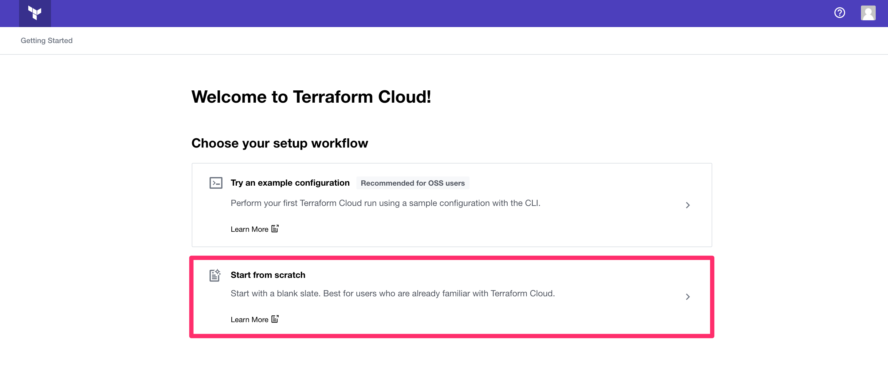

4. En la pantalla de organizaciones, introduce un nombre único para una nueva organización

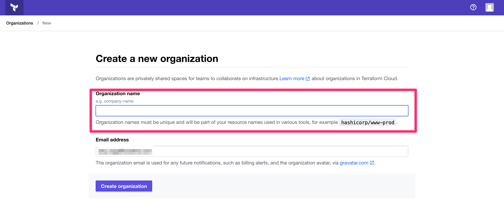

### Crear un repositorio de GitHub con un proyecto de Terraform

#### Instrucciones

1. Ve a [github](https://github.com/), inicia sesión y crea un nuevo repositorio:

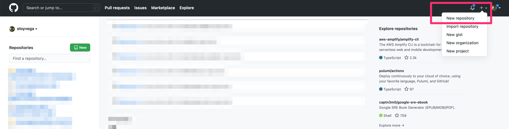

2. Introduce el nombre `tf-masterclass-demo` para el repositorio:

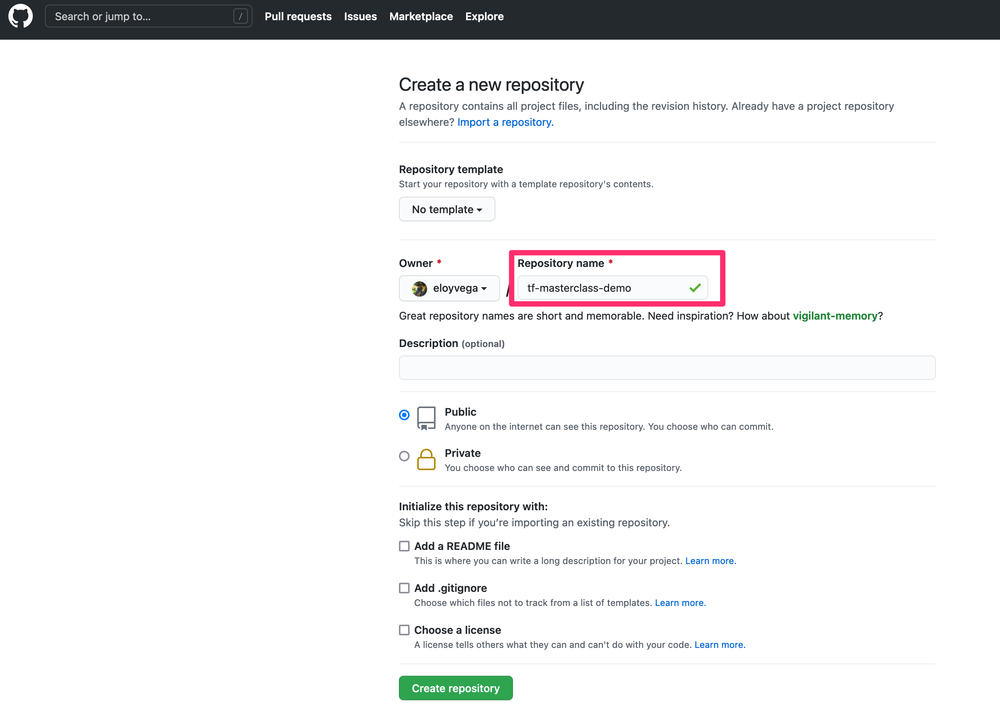

3. Copia la URL https del repositorio

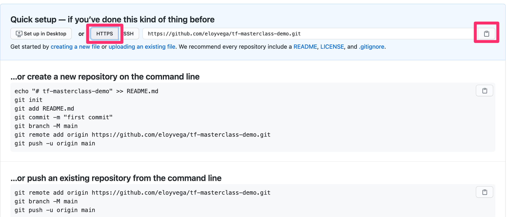

4. Establece el nombre como variable para los siguientes pasos:

```sh
REPO_URL=[PEGA EL VALOR DEL PASO ANTERIOR]
```

4. En Cloud9, clona el repositorio con el código de ejemplo:

```sh
git clone --branch terraform-project https://github.com/bootcamp-institute/terraform-master-class.git tf-masterclass-demo
```

```sh
cd tf-masterclass-demo
```

5. Borramos la configuración de git e iniciamos una nueva

```sh
rm -rf .git/
git init
git add .
git commit -m 'Inicial'
```

6. Subimos los cambios al repo de GitHub

```sh
git remote add origin $REPO_URL
git branch -M main
git push -u origin main
```

7. Modifica el archivo `main.tf` en su atributo `organization`para cambiar el valor `CHANGE_ME!`con el nombre de la organización de Terraform Cloud que creaste

8. Sube los cambios:

```sh
git add .
git commit -m "Cambiar nombre de org"
git push
```

### Crear un workspace en Terraform Cloud para el repositorio de GitHub

#### Instrucciones

1. Ve a [app.terraform.io](https://app.terraform.io), inicia sesión y empieza la creación de un nuevo _Workspace_:

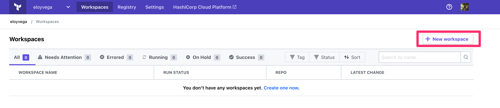

2. Selecciona la opción `Version control workflow`

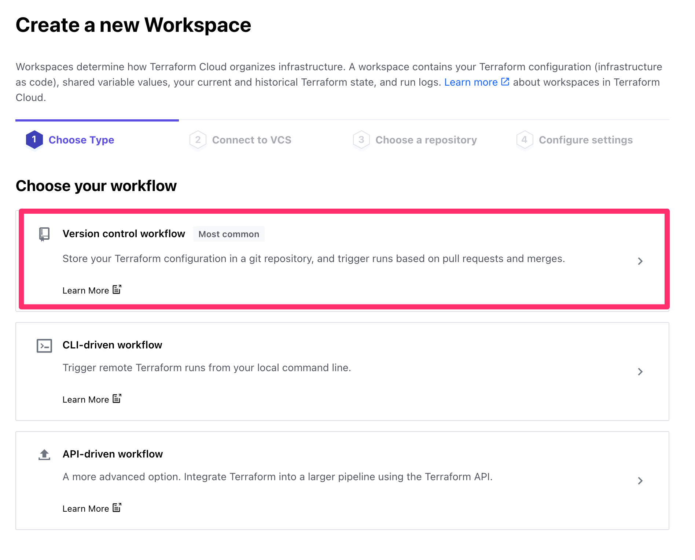

3. Selecciona la opción `GitHub.com`para el proveedor de control de versiones

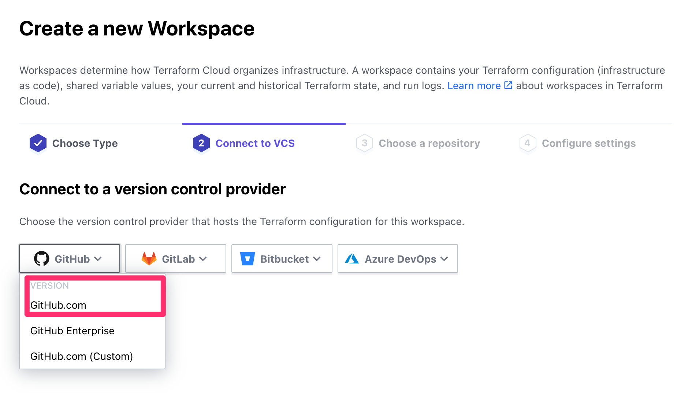

4. Debes autorizar a Terraform Cloud para poder acceder a tu cuenta de GitHub

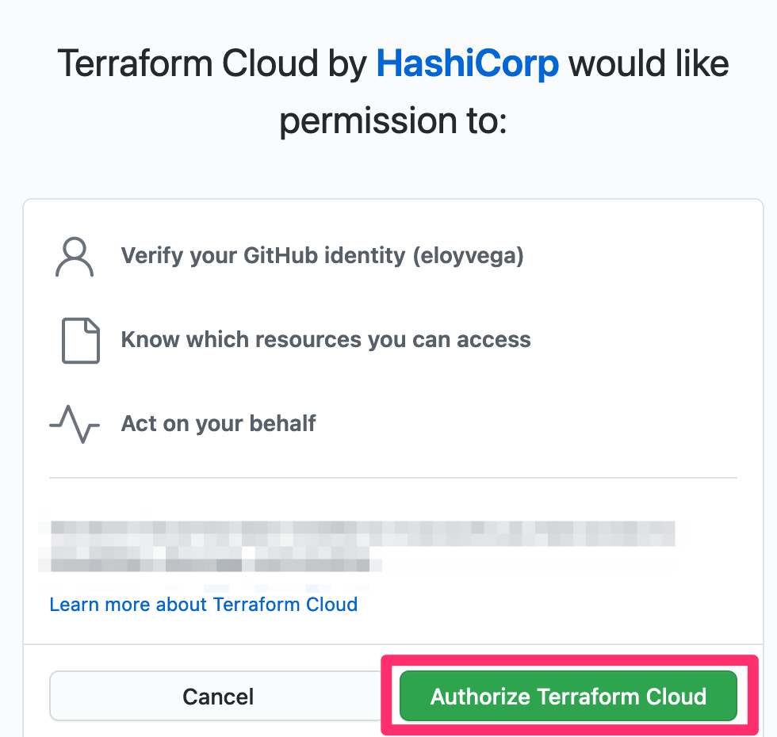

5. Filtra y selecciona el repositorio llamado `tf-masterclass-demo``

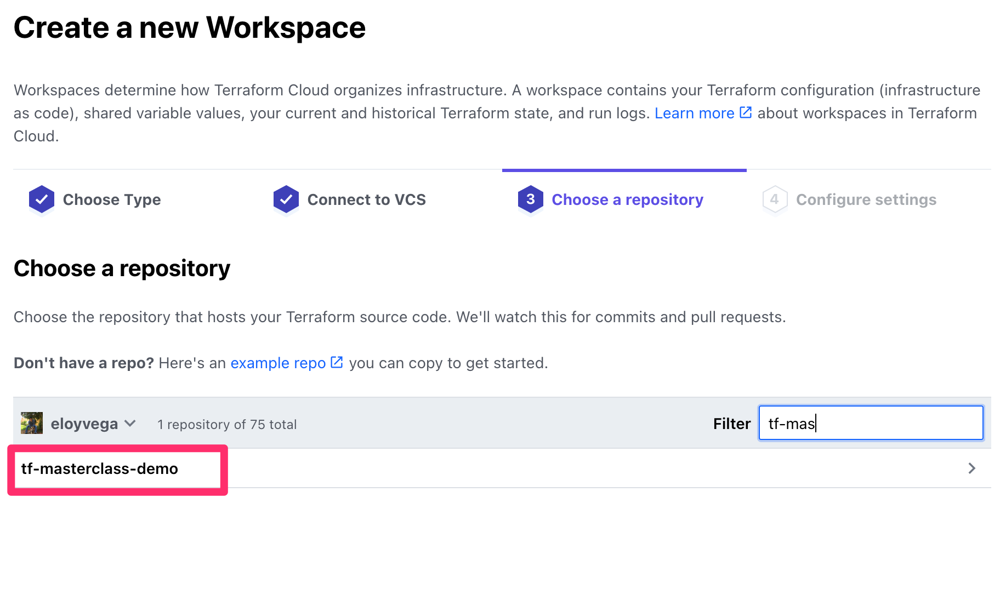

6. Habilita la opción `Automatic speculative plans` en la sección `Advanced options` y finaliza la creación del nuevo workspace

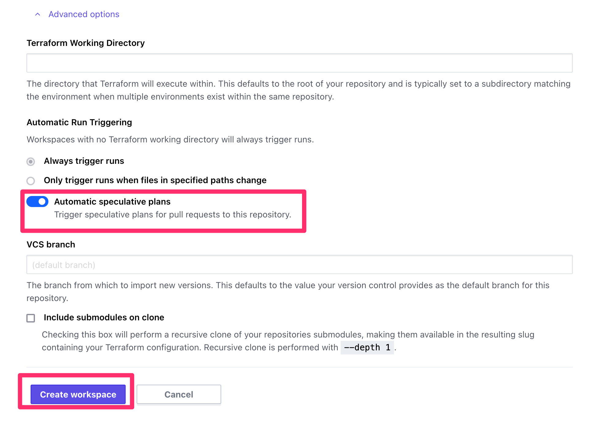

7. Ve a la sección de configuración de variables

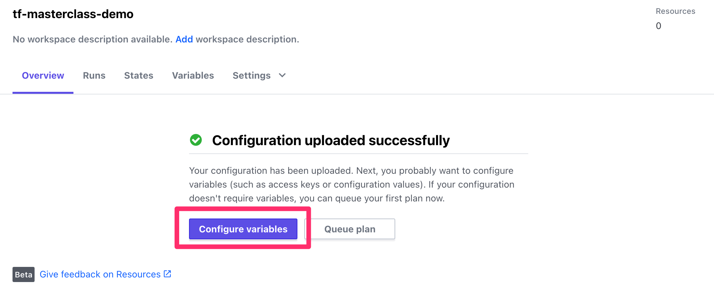

8. Agrega las siguientes variables en la sección `Environment Variables`:

- AWS_ACCESS_KEY_ID (sensitive)
- AWS_SECRET_ACCESS_KEY (sensitive)
- AWS_DEFAULT_REGION

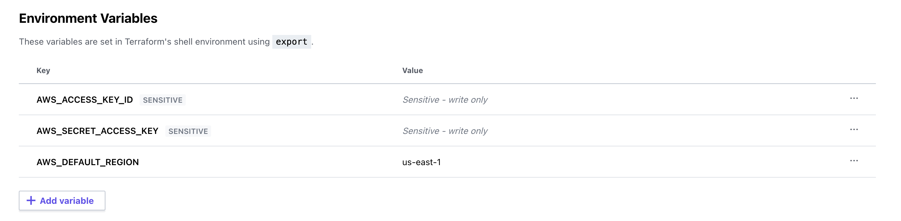

### Ejecutar acciones desde Terraform Cloud

#### Instrucciones

1. En la página principal del workspace, selecciona la opción `Queue plan`para empezar una ejecución remota

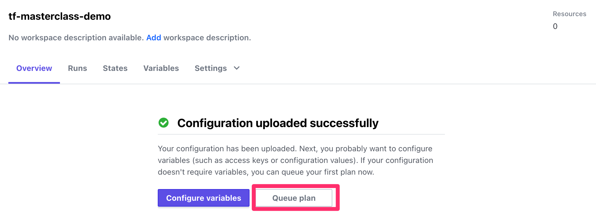

2. En la pestalla de `Runs`puedes seleccionar la ejecución actual y esperar que se termine la ejecución de `plan`. Revisa la configuración y aplica con el botón `Confirm & Apply`

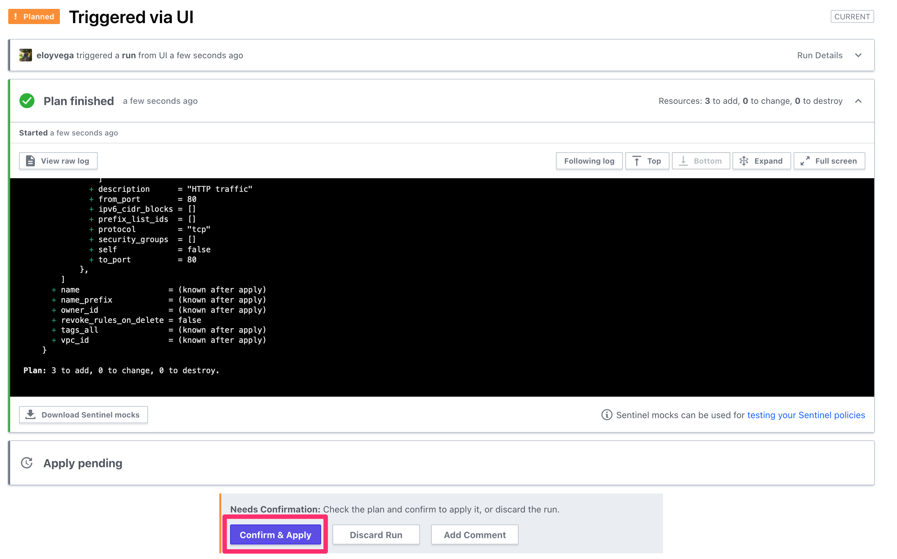

3. Escribe un mensaje y confirma la ejecución con el botón `Confirm Plan`

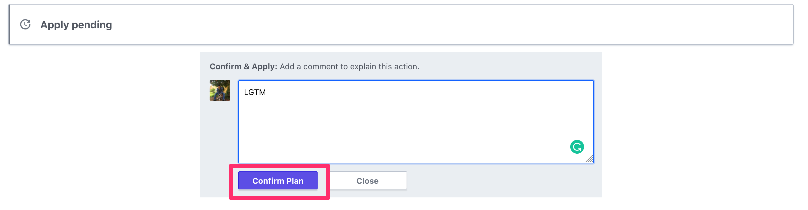

4. Valida la ejecución de la configuración con los logs de Terraform Cloud y en la consola de AWS.

5. Visita la IP pública del servidor para confirmar que se instaló Apache

### Ejecutar acciones con un flujo de trabajo de GitHub

#### Instrucciones

1. Crea una nueva rama en el repositorio de Git:

```sh
git checkout -b regla-https
```

2. Modifica el archivo `sg.tf` para agregar una regla de _ingress_ en el recurso de Security Group:

```tf
  ingress {
    description = "HTTPS traffic"
    from_port   = 443
    to_port     = 443
    protocol    = "tcp"
    cidr_blocks = ["0.0.0.0/0"]
  }
```

3. Agrega los cambios a Git y empuja la rama a GitHub:

```sh
git add .
git commit -m "Agregar regla https"
git push -u origin regla-https
```

4. Ve a tu repositorio de GitHub y crea un Pull Request con la nueva rama

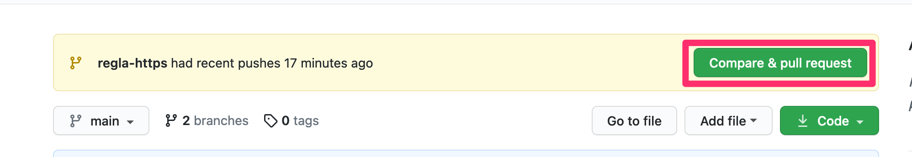

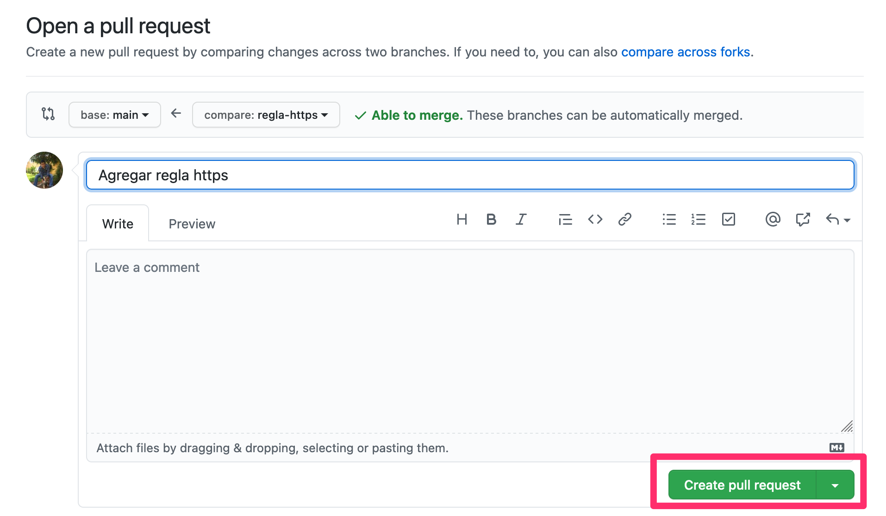

5. Una vez creado el Pull Request, espera uno segundos para que aparezca el check de Terraform Cloud y da click en `details` para visitar el Plan en Terraform Cloud

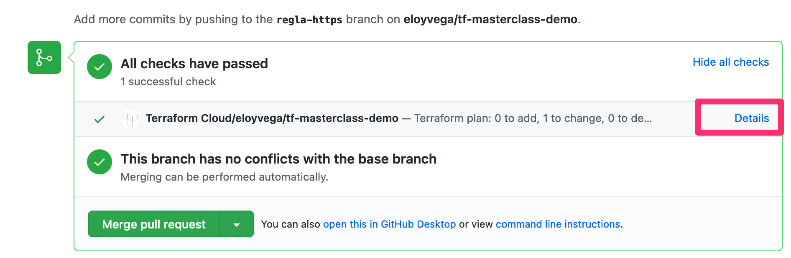

6. Da click en el botón `Merge pull request` y en el workspace de Terraform Cloud, visita la sección de Run para aplicar los cambios

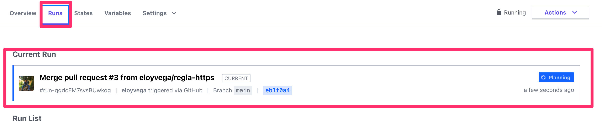

7. Valida que los cambios fueron hechos correctamente

8. Ejecuta los siguientes comandos en Cloud9:

```sh
git checkout main
git pull
```

### Ejecutar acciones localmente

#### Instrucciones

1. Ejecuta el siguiente comando:

```sh
terraform login
```

```
Terraform will request an API token for app.terraform.io using your browser.

If login is successful, Terraform will store the token in plain text in
the following file for use by subsequent commands:
    /home/ec2-user/.terraform.d/credentials.tfrc.json

Do you want to proceed?
  Only 'yes' will be accepted to confirm.

  Enter a value: yes
```

2. Visita la URL que indica la salida de Terraform para crear un nuevo Token

3. Pega el Token en la salida de Terraform:

```
Token for app.terraform.io:
  Enter a value:
```

4. Inicializa la configuración con `terraform init`

5. Realiza modificaciones y ejecuta el comando `plan` para verificar que las acciones y el estado se encuentran de forma remota

6. Utiliza el comando `terraform logout` para eliminar el token local

## Limpieza

Elimina el usuario IAM o las llaves que creamos para este demo.

Para eliminar la infraestructura creada por Terraform Cloud visita el Workspace en la sección `Settings` y la opción `Destruction and Deletion`. Planea una destrucción con el botón `Queue destroy plan` y confirma la aplicación de los cambios. Valida que los recursos son borrados de AWS.

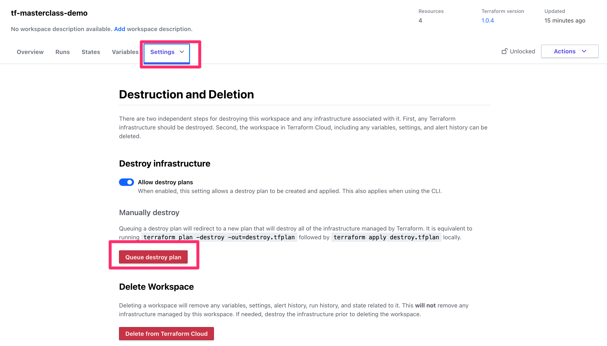

## Conclusión

En este taller aprendimos los conceptos básicos para ocupar Terraform Cloud con un repositorio de GitHub

### Comandos

- login
- logout
